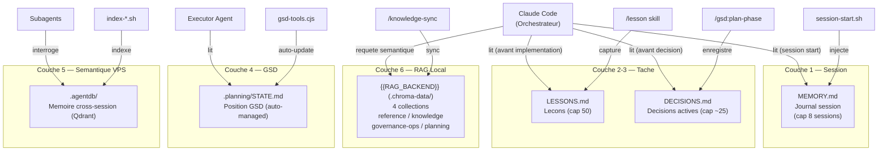
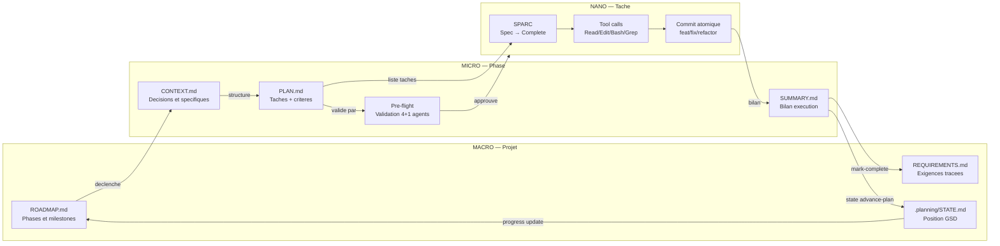

# FORGE — Logical Architecture

## 1. Layers

FORGE structure ses operations en trois couches imbriquees dont chacune opere a une granularite distincte.

| Layer | Scope | Composants | Exemple |
|-------|-------|-----------|---------|
| **MACRO** | Cycle de vie du projet — roadmap, phases, milestones | GSD (`/gsd:*` commands), ROADMAP.md, STATE.md, REQUIREMENTS.md, PROJECT.md | `/gsd:plan-phase 24` declenche le planning d'une phase |
| **MICRO** | Execution dans une phase — plan, execute, verify, closure | PLAN.md, SUMMARY.md, VERIFICATION.md, pre-flight, executor agents | L'executeur parcourt les taches du PLAN.md et commit chaque resultat |
| **NANO** | Execution d'une tache — SPARC, TDD, tool calls | Phases SPARC (Spec/Pseudo/Arch/Refine/Complete), TDD cycles, commits atomiques | Claude fait un `Edit` + `git commit` pour une sous-tache |

Les couches sont imbriquees : MACRO decoupe le projet en phases, MICRO execute une phase plan par plan, NANO execute chaque tache d'un plan.

## 2. Composants par layer

### MACRO — Orchestration projet

| Composant | Fichier / Outil | Role |
|-----------|----------------|------|
| GSD | `~/.claude/get-shit-done/` | Macro-orchestrateur : roadmap, phases, state, milestones |
| Roadmap | `.planning/ROADMAP.md` | Registre de toutes les phases avec statuts et progression |
| State | `.planning/STATE.md` | Position technique actuelle (phase courante, plan courant) |
| Requirements | `.planning/REQUIREMENTS.md` | Exigences tracees par ID avec statut de completion |
| Project | `.planning/PROJECT.md` | Contexte projet permanent (vision, contraintes, audience) |
| Contexte phase | `.planning/phases/{N}-{slug}/{N}-CONTEXT.md` | Decisions et specifiques de la phase (fruit du /gsd:discuss-phase) |

### MICRO — Execution de phase

| Composant | Fichier / Outil | Role |
|-----------|----------------|------|
| Plan | `.planning/phases/{N}-{slug}/{N}-{P}-PLAN.md` | Taches, criteres de succes, artifacts produits |
| Pre-flight | `.claude/skills/pre-flight/` | Validation multi-agents du PLAN.md (4+1 agents paralleles) |
| Plan-checker | `PLAN-CHECKER-PASS` marker | Gate mecanique obligatoire apres plan-phase |
| Executor | Worktree agent | Execute les taches du PLAN.md en commits atomiques |
| Summary | `{N}-{P}-SUMMARY.md` | Bilan d'execution : taches, deviations, decisions, duree |
| Verification | `.planning/phases/{N}-VERIFICATION.md` | UAT et criteres de succes valides apres execution |

### NANO — Execution de tache

| Composant | Outil / Pattern | Role |
|-----------|----------------|------|
| SPARC | `.claude/skills/sparc/` | Micro-execution structuree : Spec → Pseudo → Arch → Refine → Complete |
| TDD | Cycle RED/GREEN/REFACTOR | Tests d'abord, implementation minimale, refactoring |
| Tool calls | Read, Edit, Write, Bash, Grep | Outils atomiques pour lire, editer, verifier |
| Commit atomique | `git commit --no-verify` | Chaque tache = 1 commit tracable |
| Deviation rules | Regles 1-4 dans execute-plan.md | Auto-fix bugs, missing features, blockers ; escalade architecturale |

## 3. Memory Layer Stack

FORGE maintient 6 couches de memoire dont chacune repond a un besoin distinct : vitesse de recuperation, durabilite, semantique, ou patterns documentaires.

| Couche | Fichier / Systeme | Scope | Peuple par | Consomme par | Cap |
|--------|------------------|-------|-----------|-------------|-----|
| **1. Session** | `memory/MEMORY.md` | Journal des sessions recentes | Claude (closure manuelle) | Premiere lecture a chaque session | 8 sessions ; archive → `memory/archive-YYYY-MM.md` |
| **2. Lessons** | `LESSONS.md` | Cache de lecons task-scoped | `/lesson` skill | Lu avant implementation, review, debug, fix | 50 entrees ; expiration manuelle |
| **3. Decisions** | `DECISIONS.md` | Decisions architecturales actives | Claude (durant planification) | Planification et review | ~25 entrees ; archive quand obsolete |
| **4. GSD State** | `.planning/STATE.md` | Position technique GSD | `gsd-tools.cjs` (auto) | Executor agents, orchestrateur | Pas de cap — auto-managed |
| **5. AgentDB** | `.agentdb/` (VPS Qdrant) | Entrees semantiques cross-session | Scripts `index-*.sh` | Subagents (via MCP agentdb) | Illimite — semantique VPS |
| **6. {{RAG_BACKEND}}** | `.chroma-data/` (Docker local) | RAG semantique — 4 collections | Auto-sync : `session-start.sh` (startup) + `.githooks/post-commit` ; manuel : `/knowledge-sync` | `chroma_query_documents` | Illimite — local ; auto-sync deterministe a 2 checkpoints (D-B11b) |

**Regles de lecture :**
- Couche 1 (MEMORY.md) : injectee automatiquement par `session-start.sh`
- Couche 2 (LESSONS.md) : lire avant toute implementation, review, debug, fix, refactor, ou changement auth/infra
- Couche 3 (DECISIONS.md) : consulter avant toute decision architecturale
- Couche 6 ({{RAG_BACKEND}}) : interroger avant de formuler des claims sur l'architecture ou les patterns projet



## 4. File System Contract

Le systeme de fichiers FORGE est organise en 6 dossiers canoniques. Chaque dossier a une responsabilite exclusive.

```
.claude/           → Configuration Claude Code : rules, hooks, skills, integrations, settings
.planning/         → Etat GSD : phases, plans, roadmap, requirements, STATE
memory/            → Journal session : MEMORY.md + archives mensuelles
docs/              → Documentation projet : architecture, solutions, references, templates, guides
.agentdb/          → Entrees semantiques cross-session (VPS Qdrant — gitignored)
.carl/             → Regles CARL {{PROJECT}} injectees a chaque session ({{project}}tech, manifest)
```

### Detail par dossier

| Dossier | Fichiers cles | Responsabilite |
|---------|--------------|----------------|
| `.claude/rules/` | `workflow-guide.md`, `governance.md`, `skill-gate.md`, `router-rules.md`, `tool-routing.md`, `cognitive-patterns.md`, `swarm-patterns.md`, `verification-discipline.md` | Regles operationnelles auto-injectees |
| `.claude/hooks/` | `session-start.sh`, `pre-tool-use.sh`, `pre-mcp-gate.sh`, `post-knowledge-sync.sh` | Enforcement mecanique (bloquant ou nudge) |
| `.claude/skills/` | 41 skills (workflow, domain-architect, memory, review, governance, sync) | Procedures et patterns par domaine |
| `.claude/integrations.md` | — | Inventaire canonique des MCP actifs |
| `.claude/settings.json` | — | Activation MCP, hooks PreToolUse, PostToolUse |
| `.planning/` | `STATE.md`, `ROADMAP.md`, `REQUIREMENTS.md`, `PROJECT.md`, `phases/` | Etat GSD complet |
| `.planning/phases/{N}-{slug}/` | `{N}-CONTEXT.md`, `{N}-{P}-PLAN.md`, `{N}-{P}-SUMMARY.md` | Artefacts de phase |
| `memory/` | `MEMORY.md`, `archive-YYYY-MM.md` | Session journal et archives |
| `docs/architecture/` | Un dossier par solution ({{rag_backend}}/, forge/, sast/, security/, ...) | Arch-kit docs (5 artefacts par solution) |
| `docs/architecture/security/` | `supply-chain-controls.md`, `sast-pipeline.*` | Supply-chain module (SCAG + DSW) + SAST pipeline |
| `docs/audits/` | `dependencies/{pkg}/`, `cve-alerts/{CVE-ID}.md`, `cve-scan-latest.md` | Artefacts d'audit supply-chain (SCAG verdicts + DSW scans) |
| `docs/solutions/` | `automation/`, `security/`, `agents/` | Solution docs actionnables |
| `docs/references/` | `source-of-truth-map.md`, `services-and-access.md` | Governance docs et acces |
| `.carl/` | `{{project}}tech`, `manifest` | Rules CARL {{PROJECT}} (injection session-start) |

## 5. Interactions entre layers

Les trois layers forment une boucle fermee : MACRO produit la structure que MICRO execute, MICRO produit les artefacts que NANO cree, et NANO alimente en retour MICRO et MACRO via les summaries et le state.

**MACRO → MICRO :** ROADMAP.md definit les phases. STATE.md indique la phase courante. `/gsd:execute-phase` declenche l'executor qui lit le PLAN.md de la phase.

**MICRO → NANO :** PLAN.md liste les taches avec types (`auto`, `checkpoint:*`), fichiers cibles, criteres d'acceptance et done criteria. L'executor parcourt les taches et delègue chaque `type="auto"` a une execution NANO.

**NANO → MICRO :** Chaque tache produit un commit atomique + une entree dans le SUMMARY.md. Les deviations (Rule 1-3) sont documentees. Les gates architecturales (Rule 4) stoppent l'execution et retournent un checkpoint.

**MICRO → MACRO :** Le SUMMARY.md complete est commit. `gsd-tools.cjs state advance-plan` incremente le compteur dans STATE.md. `gsd-tools roadmap update-plan-progress` met a jour ROADMAP.md. Les IDs de requirements sont marques complete dans REQUIREMENTS.md.



---
*Phase: 24-forge-architecture-documentation*
*Generated: 2026-04-08*
