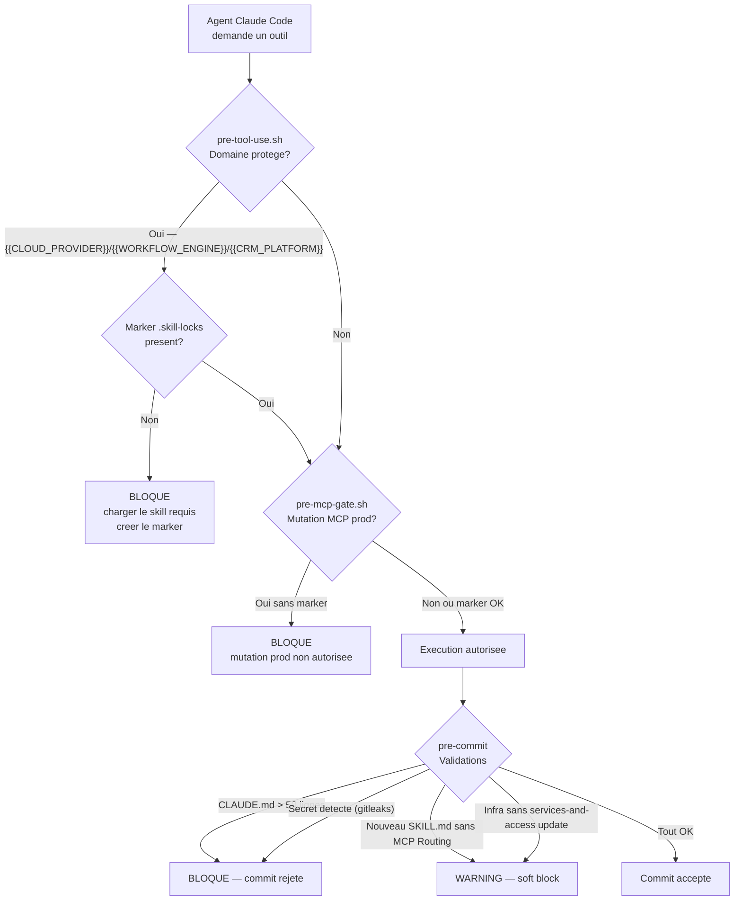

# FORGE — Security Architecture

## 1. Modele de menace

### Perimetres de confiance

Le systeme opere entierement sur la machine de developpement locale de l'operateur. Aucun composant FORGE n'est expose sur le reseau. Les seules communications exterieures sont les appels MCP vers des services tiers ({{IDENTITY_PLATFORM}}, {{CRM_PLATFORM}}, {{WORKFLOW_ENGINE}}, {{ACCOUNTING_PLATFORM}}, etc.) effectues sous controle de l'operateur.

```
[Machine dev locale — perimetre de confiance]
  |
  |-- Claude Code session (confiance totale)
  |     |-- MCP servers (confiance deleguee — selon domaine)
  |     |-- Hooks shell (confiance totale — code repo)
  |     |-- {{RAG_BACKEND}} Docker (confiance locale — localhost-only)
  |
  |-- Services tiers (confiance partielle — read only sauf mutation explicite)
  |     |-- {{IDENTITY_PLATFORM}} tenant, {{CRM_PLATFORM}}, {{WORKFLOW_ENGINE}} prod, {{ACCOUNTING_PLATFORM}}
  |
  |-- Git repo local + GitHub remote (confiance — code review)
```

### STRIDE Threat Register

| Menace | Controle FORGE |
|--------|---------------|
| Agent ecrit dans un domaine protege ({{CLOUD_PROVIDER}}/{{WORKFLOW_ENGINE}}/{{CRM_PLATFORM}}) sans charger le skill requis | `pre-tool-use.sh` bloque Write/Edit/MultiEdit/Bash — marker `.skill-locks/{domain}` obligatoire |
| Agent mute un MCP prod ({{WORKFLOW_ENGINE}}-mcp, prod-{{crm_platform}}-mcp) sans autorisation explicite | `pre-mcp-gate.sh` bloque toute mutation sur verbe create/update/delete/remove/send/upsert/patch |
| CLAUDE.md grossit au-dela de 50 lignes et perd son adherence | Pre-commit `.githooks/pre-commit` bloque le commit — comptage de lignes strict |
| Agent hallucine des patterns ou decisions projet | `cognitive-patterns.md` impose requete {{RAG_BACKEND}} avant claim — rationalization table bloquante |
| Secrets hardcodes dans le code commite | gitleaks SAST pre-commit — bloque le commit si secret detecte |
| Agent lance des operations destructives sans validation (git reset --hard, drop table, etc.) | CARL rules guidance + verification-discipline.md — Iron Law : aucune completion sans evidence fraiche |
| Agent installe une dependance externe non auditee (pip install, npm install, claude mcp add) | `pre-tool-use.sh` SCAG gate bloque tout verbe install — token one-shot `.skill-locks/scag-approved` requis (produit par `/supply-chain-audit`) |
| Dependance installee developpe une CVE post-install | DSW Layer 1 (Dependabot auto-PR) + Layer 2 (OSV-Scanner cron hebdo) + Layer 3 (PS module inventory NuGet) — SLA patch par severite |
| Session state incoherent entre sessions — contexte perdu | session-start.sh reinjecte MEMORY.md ; session-gate skill valide 20+ checks avant action prod |
| Agent affirme une decision passee sans preuve | cognitive-patterns.md rationalization table — "j'ai lu plus tot" n'est pas une preuve valide |
| Nouveau SKILL.md sans section MCP Routing | Pre-commit soft warning — governance.md impose la section |
| Infra modifiee sans mise a jour services-and-access.md | Pre-commit soft warning — gouvernance co-presence |

**Score :** 12 menaces documentees — 9 mitigees mecaniquement (hooks + pre-commit + SCAG gate + DSW), 3 par guidance (CARL + rules).

## 2. Pipeline de gouvernance

Le pipeline de gouvernance FORGE comprend quatre couches complementaires dont chacune intervient a un moment different du cycle de vie agent.

**Couche 1 — Hooks (enforcement runtime)**
Les hooks Claude Code interceptent chaque tool call avant execution. Ils bloquent ou alertent en temps reel, avant que l'action soit effectuee. Ils constituent la premiere defense et la plus robuste car ils sont mecaniquement bloquants.

**Couche 2 — Skill-gate (domaines proteges)**
Avant d'ecrire dans un domaine protege ({{CLOUD_PROVIDER}}, {{WORKFLOW_ENGINE}}, {{CRM_PLATFORM}}), l'agent doit charger le skill requis et creer un marker `.skill-locks/{domain}`. Ce marker est verifie par `pre-tool-use.sh`. Sans le marker, l'outil est bloque. Les markers sont session-scoped (gitignored) — ils doivent etre recrees a chaque session.

**Couche 3 — CARL rules (guidance comportementale)**
Les regles CARL {{PROJECT}} sont injectees par `session-start.sh` via `.carl/{{project}}tech` et `.carl/manifest`. Elles fournissent des contraintes comportementales non bloquantes mais obligatoires (ex: RULE_15 dev-first pour {{WORKFLOW_ENGINE}}, regles de classification de documents). Elles completent les hooks avec une couche de guidance semantique.

**Couche 4 — Pre-commit guards (validation au commit)**
Le hook `.githooks/pre-commit` valide chaque commit avant acceptation. C'est la derniere defense : budget de lignes CLAUDE.md, co-presence governance, secret scanning gitleaks, PSScriptAnalyzer pour {{SCRIPTING_LANG}}.



## 3. Hooks detail

| Hook | Fichier | Declencheur | Action | Bloquant |
|------|---------|------------|--------|---------|
| **session-start** | `.claude/hooks/session-start.sh` | SessionStart (chaque demarrage + compact) | {{RAG_BACKEND}} auto-start (docker compose), healthcheck 5 retries x 500ms, rapport staleness >24h, injection MEMORY.md compact, **auto incremental sync via `scripts/knowledge-sync.py` (source=startup uniquement, lock partage, 20s soft cap)**, **upstream drift auto-resolve via `scripts/upstream-watch/auto-resolve.sh` (source=startup uniquement, 30s soft cap, trusted-host allowlist, diff cap, stderr kept out of additionalContext)** | Non — silencieux si Docker absent |
| **pre-tool-use** | `.claude/hooks/pre-tool-use.sh` | PreToolUse (Write, Edit, MultiEdit, Bash) | (1) Verifie marker `.skill-locks/{domain}` pour les domaines {{CLOUD_PROVIDER}}, {{WORKFLOW_ENGINE}}, {{CRM_PLATFORM}} selon le chemin de fichier ou la commande. (2) **SCAG gate** : detecte les verbes install dans Bash (pip/uv/npm/yarn/pnpm/bun/claude-mcp-add), bloque si token `scag-approved` absent, consomme le token one-shot si present | **Oui** — exit 2 avec message si marker absent |
| **pre-mcp-gate** | `.claude/hooks/pre-mcp-gate.sh` | PreToolUse (MCP mutations) | Bloque les mutations sur {{WORKFLOW_ENGINE}}-mcp, prod-{{crm_platform}}-mcp, prod-{{crm_platform}}-care-mcp si marker absent — detecte les verbes mutants (create/update/delete/remove/send/upsert/patch/add-tags/remove-tags/edit) | **Oui** — exit 2 avec message |
| **post-knowledge-sync** | `.claude/hooks/post-knowledge-sync.sh` | PostToolUse (Write, Edit, MultiEdit) | Queue append vers `.claude/.sync-queue`, flush nudge consolide apres 10s idle — ne sync PAS (D-B21) | Non — nudge seulement |
| **kv-secret-rule8-nudge** | `.claude/hooks/kv-secret-rule8-nudge.sh` | PostToolUse (Bash) | Detecte `az keyvault secret set/delete` + `certificate import` ; emet `additionalContext` rappelant {{PROJECT}}TECH_RULE_8 (mutation KV via CLI = pas de git footprint → update services-and-access.md same-commit). Fail-safe : exit 0 silencieux sur toute erreur ou non-match | Non — nudge seulement |
| **post-commit** (git) | `.githooks/post-commit` | Apres chaque `git commit` | **Auto incremental sync via `scripts/knowledge-sync.py` en background detache — retourne en <10ms, lock partage avec session-start** | Non — post-commit ne peut pas aborter |
| **memory-retention** | Session end reminder | Fin de session (guidance) | MEMORY.md update reminder — closure protocol step 2 | Non — guidance |
| **pre-compact** | `.claude/hooks/pre-compact.sh` | Avant compaction du contexte | Sauvegarde l'etat volatile avant que le contexte soit compacte | Non — preventif |
| **pre-agent** | `.claude/hooks/pre-agent.sh` | Avant spawn de subagent | Injection de contexte dans chaque subagent (collections {{RAG_BACKEND}}, CARL rules) | Non — enrichissement |
| **codex-done-checklist** | `.claude/hooks/codex-done-checklist.sh` | UserPromptSubmit | Si le prompt matche `codex done`, injecte la checklist `verification-discipline.md` § "Codex done {id} valide" (diff lu + re-verification + artefacts cites) comme contexte frais — mecanisme deterministe au chokepoint de la soumission de prompt (todo 109 / M1) | Non — injection de contexte |

**Note :** `pre-tool-use.sh` et `pre-mcp-gate.sh` sont les seuls hooks bloquants. Les autres sont des hooks de guidance ou de nudge.

## 4. Skill-Gate — Domain Routing

| Domaine | Triggers | Skills requis | Marker |
|---------|---------|--------------|--------|
| **{{CLOUD_PROVIDER}} / {{IDENTITY_PLATFORM}} / {{IDENTITY_PROVIDER}} / Graph / {{SCRIPTING_LANG}}** | `.ps1`, `.psm1`, `.psd1`, `scripts/` ({{SCRIPTING_LANG}}), Graph, Exchange, Intune, {{IDENTITY_PROVIDER}}, {{IDENTITY_PLATFORM}} | `{{cloud_provider}}-{{identity_platform}}-architect` + `{{project}}-{{scripting_lang}}-script-writer` si script/module {{SCRIPTING_LANG}} | `mkdir -p .skill-locks && touch .skill-locks/{{cloud_provider}}` |
| **{{CLOUD_PROVIDER}} infra** | Bicep, ARM, `azd`, Storage, Compute, quotas, diagnostics, cost, deploy | `{{cloud_provider}}-infra-architect` | `mkdir -p .skill-locks && touch .skill-locks/{{cloud_provider}}` |
| **{{CLOUD_PROVIDER}} AI / Foundry** | OpenAI, Foundry, AI Search, RAG, Speech, Document Intelligence | `{{cloud_provider}}-ai-architect` | `mkdir -p .skill-locks && touch .skill-locks/{{cloud_provider}}` |
| **{{WORKFLOW_ENGINE}} workflow design / architecture** | `{{WORKFLOW_ENGINE}}/`, workflow JSON, architecture workflow, orchestration | `{{WORKFLOW_ENGINE}}-workflow-architect` | `mkdir -p .skill-locks && touch .skill-locks/{{WORKFLOW_ENGINE}}` |
| **{{WORKFLOW_ENGINE}} node config / expressions** | IF/Switch, expressions, validation, property dependencies | `{{WORKFLOW_ENGINE}}-node-expert` | `mkdir -p .skill-locks && touch .skill-locks/{{WORKFLOW_ENGINE}}` |
| **{{WORKFLOW_ENGINE}} code nodes** | JavaScript/Python dans Code nodes {{WORKFLOW_ENGINE}} | `{{WORKFLOW_ENGINE}}-code-nodes` | `mkdir -p .skill-locks && touch .skill-locks/{{WORKFLOW_ENGINE}}` |
| **{{CRM_PLATFORM}} / {{CRM_PLATFORM}} / webhooks** | {{CRM_PLATFORM}}, {{CRM_PLATFORM}}, {{CRM_PLATFORM}}, snapshots, workflows, API v2 | `{{crm_platform}}-architect` | `mkdir -p .skill-locks && touch .skill-locks/{{crm_platform}}` |

**Regles de selection :**
- Si plusieurs lignes {{CLOUD_PROVIDER}} s'appliquent, choisir le skill le plus specifique au sujet
- Si la tache touche du {{SCRIPTING_LANG}} {{PROJECT}}, toujours ajouter `{{project}}-{{scripting_lang}}-script-writer`
- Ne jamais charger un skill "au cas ou"

## 5. CARL enforcement

CARL (Claude Adaptive Rule Layer) est le systeme de regles comportementales dynamiques de {{PROJECT}}. Contrairement aux hooks qui bloquent mecaniquement, CARL injecte des contraintes semantiques et des politiques metier directement dans le contexte de chaque session.

**Injection :** `session-start.sh` lit `.carl/{{project}}tech` et `.carl/manifest` et les emet dans `additionalContext`. Claude Code reçoit ces regles comme partie integrante du contexte de session — elles s'appliquent sans action manuelle.

**Nature des regles CARL :**
- Politiques metier (ex: RULE_15 — dev-first pour {{WORKFLOW_ENGINE}} : tout changement va d'abord sur {{WORKFLOW_ENGINE}}-dev, jamais directement en prod)
- Domaines actifs et regles specifiques (CARL {{CLOUD_PROVIDER}}{{IDENTITY_PLATFORM}}, CARL {{CRM_PLATFORM}}, etc.)
- Conventions de routing (modeles, executors, transports)
- Contraintes de classification de documents

**Fichiers cles :**
- `.carl/{{project}}tech` — Regles specifiques a {{PROJECT}} (metier + technique)
- `.carl/manifest` — Manifeste des domaines CARL actifs pour la session

**Limites :** CARL est guidance, pas enforcement mecanique. Un agent peut techniquement ignorer une regle CARL — c'est pourquoi les regles critiques (skill-gate, MCP gate) ont un enforcement hook en plus de la regle CARL.

## 6. Pre-commit guards

Le hook `.githooks/pre-commit` valide chaque commit avant acceptation. Il est installe via `git config core.hooksPath .githooks` et s'execute automatiquement pour chaque `git commit`.

| Guard | Type | Verification | Impact |
|-------|------|-------------|--------|
| **CLAUDE.md budget** | Hard | Compte le nombre de lignes de `CLAUDE.md` — refuse si > 50 | BLOQUE le commit |
| **gitleaks SAST** | Hard | Scan des secrets hardcodes dans les fichiers modifies | BLOQUE le commit si secret detecte |
| **PSScriptAnalyzer** | Hard (si {{SCRIPTING_LANG}}) | Analyse statique des scripts `.ps1`, `.psm1` | BLOQUE si erreur critique |
| **MCP co-presence** | Soft | Si un nouveau MCP est ajoute, verifie la presence dans `integrations.md` | WARNING — commit non bloque |
| **Infra co-presence** | Soft | Si un serveur/endpoint est modifie, verifie la presence dans `services-and-access.md` | WARNING — commit non bloque |
| **SKILL.md MCP Routing** | Soft | Si un nouveau `SKILL.md` est ajoute, verifie la section `## MCP Routing` | WARNING — commit non bloque |

**PLAN-CHECKER-PASS marker :** Le plan-checker (`/gsd:plan-phase` puis verification) produit un marker `.planning/phases/{phase}/PLAN-CHECKER-PASS`. Sans ce marker, un plan ne peut pas passer en execution — c'est un gate mecanique obligatoire.

## 7. Supply-Chain Controls Module

Le module Supply-Chain Controls est le composant FORGE qui gouverne l'entree et la surveillance des dependances externes dans le repo. Il repond a la question : **qu'est-ce qui peut entrer dans le repo avant d'etre execute par Claude ou par CI, et comment surveille-t-on ce qui est deja entre**.

### Architecture du module

```
┌──────────────────────────────────────────────────────────────────┐
│                    INSTALL-TIME (SCAG)                           │
│                                                                  │
│  Install Gate Hook ──► IBA (deterministe, <5s) ──► Triad (3 LLM)│
│  (pre-tool-use.sh)     (Grep patterns)             (parallele)  │
│  token one-shot         iba-patterns.yaml           sast/sentinel│
│  scag-approved          protected-files.yaml        /adversarial │
│                              │                          │        │
│                              └──── Consolidation ───────┘        │
│                                        │                         │
│                                APPROVE / CONDITIONAL / REJECT    │
│                                        │                         │
│                                  Install autorise                │
└──────────────────────────────────────────────────────────────────┘
                                         │
                                         ▼
┌──────────────────────────────────────────────────────────────────┐
│                    RUN-TIME (DSW)                                 │
│                                                                  │
│  Layer 1: Dependabot        Layer 2: OSV-Scanner     Layer 3: PS │
│  (quotidien, auto-PR)      (cron hebdo, OSV.dev)    (NuGet man.) │
│  .github/dependabot.yml    .github/workflows/        module-inv. │
│                             osv-scan.yml              .json       │
│                                                                  │
│  ──► CVE detectee ──► Triage ──► SLA patch ──► Fix ou Accept     │
│                                                                  │
│  Bump majeur ──► Re-trigger SCAG complet                         │
└──────────────────────────────────────────────────────────────────┘
```

### Composants

| Composant | Type | Fichier cle | Role |
|---|---|---|---|
| **Install Gate** | Hook (hard) | `pre-tool-use.sh` | Bloque tout install verb sans token SCAG |
| **IBA** | Step deterministe | `iba-patterns.yaml` + `protected-files.yaml` | Detecte 6 classes de comportement install dangereux |
| **Triad** | 3 agents LLM | `/supply-chain-audit` skill | sast-scanner + security-sentinel + adversarial-reviewer |
| **MCP Allowlist** | Exemption | `.claude/allowlists/mcp-preapproved.json` | Fast-path pour MCP pre-approuves |
| **Dependabot** | Layer 1 DSW | `.github/dependabot.yml` | CVE monitoring quotidien, auto-PR |
| **OSV-Scanner** | Layer 2 DSW | `.github/workflows/osv-scan.yml` | CVE monitoring hebdo, base independante |
| **PS Inventory** | Layer 3 DSW | `scripts/generate-ps-module-inventory.ps1` | Couverture NuGet pour modules {{SCRIPTING_LANG}} |
| **Patch SLA** | Standard | `docs/standards/patch-management-standard.md` | Critical 24h, High 7d, Medium 30d, Low 90d |
| **CARL Rule 17** | Guidance AI | `.carl/{{project}}tech` | Rappel Claude avant tout install |

### FORGE Patterns associes

| Pattern | Fichier | Scope |
|---|---|---|
| `supply-chain-audit-triad` | `docs/architecture/forge/supply-chain-audit-triad.md` | 3-agent parallel audit gate |
| `dependency-install-gate` | `docs/architecture/forge/dependency-install-gate.md` | Hook enforcement + token one-shot |

### Architecture-kit complet

Le module dispose de son propre architecture-kit dans `docs/architecture/supply-chain/` :

| Artefact | Contenu |
|---|---|
| `logical-architecture.md` | Composants, data flows, token lifecycle, artefacts |
| `integration-architecture.md` | Points d'integration FORGE, GitHub, {{RAG_BACKEND}}, skills |
| `security-architecture.md` | Threat model, IBA classes, triad coverage, CVE response |
| `solution-architecture.md` | Decisions, learnings dogfood graphifyy, evolution roadmap |
| `operating-model.md` | Procedures operationnelles, maintenance, troubleshooting |

Resume executif : `docs/architecture/security/supply-chain-controls.md` (v0.3).

---
*Phase: 24-forge-architecture-documentation*
*Updated: 2026-04-12 — supply-chain controls module (v0.3)*
*Generated: 2026-04-08*
